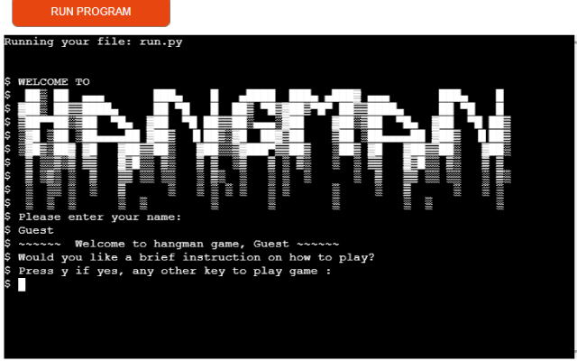
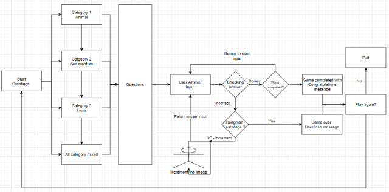
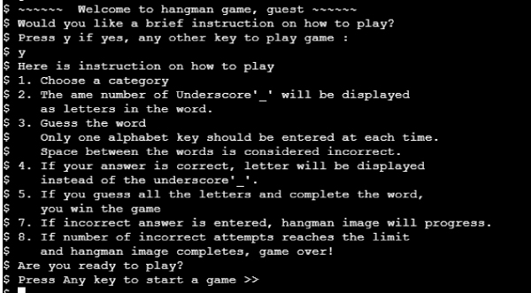
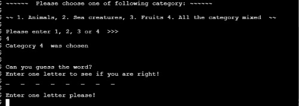
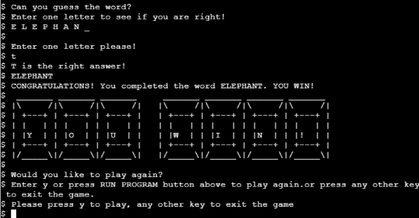
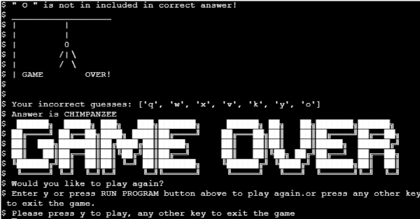
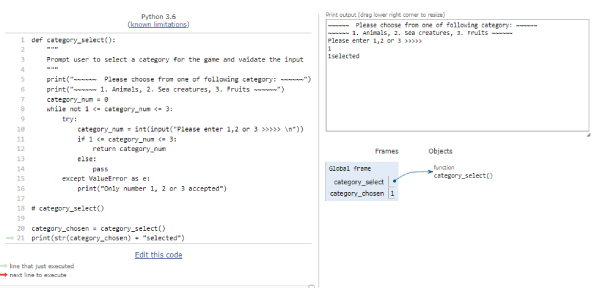
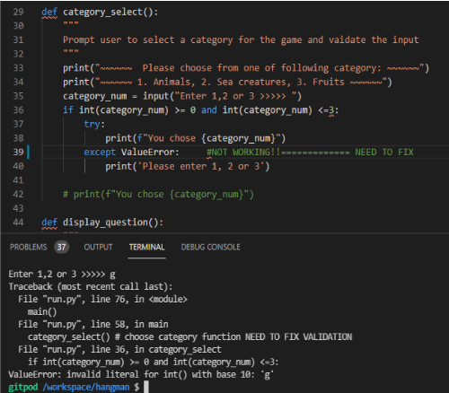
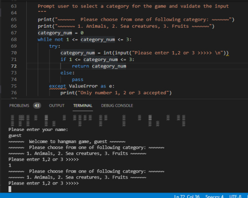

# Hangman

This site is created as a Milestone project for Code Institute's Software Development course.

Here is a link to the live project: [Hangman](https://https://pp3-hangman.herokuapp.com/)

This is the opening image of the game in Heroku site

## The purpose for this site 
---
Hangman is a classic terminal based game that a lot of people are familiar with.
This game has same familiar structure and offers three categories of words that users can choose from.

## User experience

### Target Audience

This game is created for anyone who wants to have fun playing a word game.

####  User goals 

* User wants to enjoy playing word game.
* User wants to win the game and get winning message when it is achieved
* User wants to have clear feedback for their action 

####  Site owner’s goal 

The main objective for creating this site was to gain skill set to build a simple but fun terminal-based game. 
Hangman game is widely available on the web so I have created extra user interactivity by giving them a choice of category. This also gives a control of the difficulty level. By choosing a specific category, answers can be narrowed down, making it easier to guess the word. By choosing a selection from all categories gives more wide possibility of answer to make it harder to guess the answer.

###  User Stories 

This site is created following user’s expectations in mind.

* A first time user would like to:
    * Have a clear instruction on what the game objective and process
    * Clear feedback for their action
    * Graphical display for fun factor

* A returning user would like to have the following additional 
   * Quick response time
   * Clear feedback for their input
   * Choice of difficulty level
   * Choice to skip the instruction and return to the game

* As a site creator I would like to provide:
  * Interactive game that runs on terminal
  * Clear feedback to user's response
  * Provide choice of difficulty level

###  Designing stage 

This is the flowchart made during the planning stage of the project. This flowchart has been used to visualise the functions and behaviour control during the building stage of the project.
.
Initial design flowchart 

Hangman Flowchart

##  Features 
---

The game has following features

* Display greetings with user name
  
* Display the instruction when user choose to
* Category choice user can select from
* Playing game
* Choice to play again or exit the game

###  Game process 

1.  Upon loading the page, large logo ascii art displays and asks user to input their name.
As the name is not relevant to the game, user can input any letters or numbers desired.
When user completes entering their name, welcome message with the name appears.

    

Logo and welcome message

    
    

2. User will be asked if they want a brief instruction displayed or skip to start a game.
If y is pressed for yes, instruction will be displayed.
    

Instruction display

    
    

3. Before the game starts, user has a choice of categories.

4. Once the category is chosen, underscores will display. These underscores represent a letter in the word selected as the answer.

    

Selecting a category and display of underscores

    
    
   

5. User is now asked to guess the word and enter one alphabet key.

6. If the input letter is in the selected word, user get notified and the letter replaces underscore.

7. If the user's input is incorrect (i.e. letter not in the selected word), user will be notified and hangman image display increases one stage at a time.

8. Game will be completed weather user fills all the letters in the selected word or hangman image completely displays.

   * In the event of user's win, the winner message in keyboard layout appears.
        

YOU WIN display

        
        

   * When the game completes with reaching the limit of incorrect attempts, big game over ascii text will display below the hangman image.
          

GAME OVER display

          
          

9. User will now be asked if they want to start another game or exit.

#### Features Left to Implement

I am aware that the code written in the program may not be the most efficient way. The decision was made to focus on creating workaround solutions to build a fully functioning program with the code that I learned and understand during the rather short space of time given for the course module completion and the project submission deadline.
When I gain more time and knowledge of Python language, I intend to come back to this program and try improving program efficiently and interactivity. 

##  Technologies 

###  Languages 

 * Python3

###  Other Technologies, Frameworks & Libraries 
random and time functions are used in the code.
* Random is used to display a random choice from the list
* Time is used to control the display speed to prevent the text displaying too fast.
* Code Institute's full template for Python is used in order for the program to display properly in deployed site on Heroku.

 
 
##  Testing 
Testing was carried out by creating each function at a time to minimise the small errors impacting the whole project.

* [Python Tutor](http://pythontutor.com/visualize.html#mode=edit) was used throughout the project's building/testing stage to troubleshoot on errors.
    

Python Tutor

    
          

### Here are some of the challenges I encountered and steps taken to fix.

1. Validating user input for category choices.
  try/except method is used to validate the user input for category choice, however it was throwing system error instead of pre-set printing messagge 
  This was fixed by changing the condition for the while loop.

    

category_choice error

    
    

2. Space inside selected answer preventing game completion.
As function compares answer and correct user input list as set, empty space included in the answer(e.g. kiwi fruit) was preventing the both lists to match even though all the letters were filled. 
This issue was resolved by simply creating a new variable with no space and configure the function to refer the new list instead.

3. category_choice function was repeating despite the user input being the right condition. 
I was spending quite some time changing the approach within the while loop in the function without any success.
Thanks to Johann in Code Institute's tutor support who has pointed out eventually that the function is called twice (first inside main function and then again when variable is set using the return value from the function). The solution was very simple just to remove the one from main function.
    

category_choice while repeating error

    
    

4. When len(category) was placed as parameter inside randint method instead of list length as a number to accommodate the flexibility for list items expansion, an error occurred but not every time. This was because the randint(len(category)) produced 1 bigger number than list index available. By placing -1 after the parameter has resolved the issue.
This solution is not used in the final code ater all as random.choice() is used instead to give more flexibility for changes to list items.

###  Validating code 

The code is validated in PEP8 online validator.

PEP8 online validator

    
    

##  Deployment 
### Here is the procedure taken to deploy the project on Heroku

Prior to deploy, two steps below are taken to prepare the project being deployed.
1. Ensure all input method texts ends with \n for the program to display properly on Heroku site
2. All requirements are mentioned in requirements.txt file. This was done by typing following command in GitHub workspace terminal.
  pip3 freeze > requirements.txt
This project does not require any extra requirement but the procedure is taken just in case.
3. Sign up and log in to Heroku[heroku.com]
4. Click on Create new app button. 
5. In the next page displayed, enter the project name, pp3-hangman and select Europe as region, then click Create app button.
6. Open settings page by pressing settings tab. Following has to be done in exact order.
   In the Buildpack section of the setting page, press Add Buildpack button and choose python then, click save changes.
   Select Add Buildpack button again and choose nodejs then save changes
7. Navigate to deploy page by clicking the tab
   Choose GitHub then click Connect to GitHub button.
   In the popup window, click authorize and then input password for GitHub
   Once my Git Hub repositries are connected, type in the name in the search for the project, hangman.
   When the repositories is found, click connect button for the repository.
   GitHub button indicates connected when connection was successful.
8. As I wanted to have control when to deploy the version, I have chosen manual deployment by pressing Deploy branch button instead of Enable Automatic Deploys. 
9. once the deployment completed View button will appear. This View button will open the terminal game in the new window.

##  Credits 

####  Coding 

* https://enhancer298.net/2020/07/10/hangman1/    This site's tutorial of making Hangman game was used as a general guidance and their approach is used as a stepping stone for initial stage of this project. Also the image of the hangman stage is used from this site.

* https://www.python-izm.com/   Used for general reference for python code

* [Python Tutor](http://pythontutor.com/visualize.html#mode=edit) This site was used to pinpoint where and why the errors are causing.

* https://note.nkmk.me/python-random-choice-sample-choices/    This site's example of random.choice()helped me to apply this method for selecting a random item from nested list of category

###  Media 

* https://diagrams.net/       This site was used to create the flowchart in the planning stage of the project. 
* http://patorjk.com/software/taag/   ascii art for  title/win/game over  was created in this site

