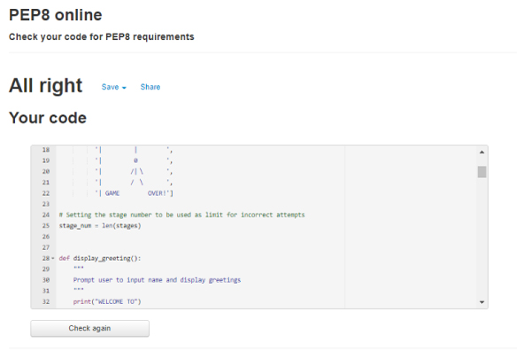

# Hangman

- [Hangman](#hangman)
  * [The purpose for this site](#the-purpose-for-this-site)
  * [User experience](#user-experience)
    + [Target Audience](#target-audience)
      - [User goals](#user-goals)
      - [Site owner’s goal](#site-owner-s-goal)
    + [User Stories](#user-stories)
    + [Designing stage](#designing-stage)
  * [Features](#features)
    + [Game process](#game-process)
    + [Data model](#data-model)
      - [Features Left to Implement](#features-left-to-implement)
  * [Technologies](#technologies)
    + [Languages](#languages)
    + [Other Technologies, Frameworks & Libraries](#other-technologies--frameworks---libraries)
  * [Testing](#testing)
    + [Known error present:](#known-error-present-)
    + [Here are some of the challenges I encountered and steps taken to fix.](#here-are-some-of-the-challenges-i-encountered-and-steps-taken-to-fix)
    + [Validating code](#validating-code)
  * [Deployment](#deployment)
    + [Here is the procedure taken to deploy the project on Heroku](#here-is-the-procedure-taken-to-deploy-the-project-on-heroku)
  * [Credits](#credits)
      - [Coding](#coding)
    + [Media](#media)

<small><i><a href='http://ecotrust-canada.github.io/markdown-toc/'>Table of contents generated with markdown-toc</a></i></small>

This site is created as a portfolio project for Code Institute's Software Development course.

Here is a link to the live project: [Hangman](https://pp3-hangman.herokuapp.com/)

Hangman is a classic word game that a lot of people are familiar with.
This game runs on a terminal based window but has the same familiar structure and offers category choices that users can select from.

## The purpose for this site 
This site is created to provide a little fun in the terminal environment which can be boring sometimes.
Except for the mock terminal setting which was provided by Code Institute's template, the game is made purely using Python language.

## User experience

### Target Audience

This game is created for anyone who wants to have fun playing a word game.
Also this game is a good introduction to the terminal window for anyone who is not familiar with terminal environment. 

####  User goals 

* User wants to enjoy playing word game.
* User wants to win the game and get winning message when it is achieved
* User wants to have clear feedback for their action 

####  Site owner’s goal 

The main objective for creating this site was to gain the skill set to build a simple but fun terminal-based game using Python. 

Hangman game is widely available on the web so I have created extra user interactivity by giving them a choice of category. This also gives a control of the difficulty level. By choosing a specific category, answers can be narrowed down, making it easier to guess the word. Choosing a selection from all categories gives a wider possibility of answers to make it harder to guess.

###  User Stories 

This site is created based on the user’s expectations in mind.

* A first time user would like to:
    * Have a clear instruction on what the game objective and process is
    * Clear feedback for their action
    * Graphical display for fun factor

* A returning user would like to have the following in addition to the above:
   * Quick response time
   * Clear feedback for their input
   * Choice of difficulty level
   * Choice to skip the instruction and start the game

* As a site creator I would like to provide:
  * Interactive game that runs on terminal
  * Clear feedback to user's response
  * Fun appearance 
  * Provide choice of difficulty level

###  Designing stage 

This is the flowchart made during the planning stage of the project. This flowchart has been used to visualise the functions and behaviour control during the building stage of the project.

Initial design flowchart 

Hangman Flowchart

This flowchart was referenced during the building stage to make sure the data flows are executed appropriately to complete the game process.

##  Features 
---

The game has the following features

* Display greetings with user name
* Display the instruction when user opts for
* Category choice user can select from
* Playing the game
* Choice to play again or exit the game

###  Game process 

1.  Upon loading the page, a large logo ascii art displays and asks the user to input their name. 
As the name is not relevant to the game, user can input any letters or numbers or characters desired.
When the user completes entering their name, a welcome message with their name appears.

    

Logo and welcome message

    
    

2. User will be then asked if they want a brief instruction displayed or skip to start the game.
If 'y' is pressed for yes, the instruction will be displayed.
The user can skip the instruction by pressing any other key except 'y'.
After reading the instruction, the user can press any key to start a game.

    

Instruction display

    
    

3. Before the game starts, the user has a choice of categories. Category 1 to 3 is a random selected word from a chosen category and choosing 4 will be a random selection from category 1-3.
Any user input other than number 1 to 4 will repeat the input prompt for the selection.
Here, the user input is validated each time and appropriate feedback is given for invalid data entry.

4. Once the category is chosen, a word will be selected randomly and underscores will display. These underscores represent a letter in the word selected as the answer.

    

Selecting a category and display of underscores

    
    
   

5. User is now asked to guess the word and enter one alphabet key.

6. If the input letter is in the selected word, the user is notified and the letter replaces the underscore.
In the case that the user inputs a key that is already displayed among undersores (i.e. already answered correctly), user get a sarcastic comment as feedback for their input.

7. If the user's input is incorrect (i.e. a letter not in the selected word), the user will be notified and the hangman image increases one stage at a time. 

   The list of all incorrect input letters for the current game will display to remind user of their incorrect guesses.

   

Hangman stage display

     
  

8. Game will be completed when the user fills all the letters in the selected word or the hangman image completely displays.

   * In the event of the user's win, the winner message in keyboard layout appears.
        

YOU WIN display

        
        

   * When the game completes by reaching the limit of incorrect attempts, a 'game over' ascii art will display below the hangman image.
          

GAME OVER display

          
          

9. The user will now be asked if they want to start another game or exit.
When exit key is chosen, thank you message displays.

### Data model

The flowchart below summarises the data flow in this program.

Data model

#### Features Left to Implement

I am aware that the code written in the program may not be the most efficient way. The decision was made to focus on creating workaround solutions to build a fully functioning program with the code that I learned and understand during the rather short space of time given for the course module completion and the project submission deadline.
When I gain more time and knowledge of Python language, I intend to come back to this program and try improving program efficiency and interactivity. 

A further features I would like to implement in the future is scraping a web site text contents or importing a csv file for list of words selection.
Implementing this feature will require some API's and much more knowledge, but the end product would be much more interesting. 

##  Technologies 

###  Languages 

 * Python3

###  Other Technologies, Frameworks & Libraries 
random and time methods are used in the code.
* Random is used to display a random choice from the list.
* Time is used to control the display speed to prevent the text displaying too fast.
* The Code Institute's GitHub full template for Python is used in order for the program to display properly in the deployed site on Heroku.

 
##  Testing 
Testing was carried out on each function at a time to minimise the small errors impacting the whole project.
Each function is tested to ensure expected behaviour was performed and correct results are returned.

After coding was completed, all input elements were tested by entering invalid data to ensure that invalid user input returns appropriate feedback to the user and does not result in game interruptions.

The code was tested using both GitPod terminal and the Heroku deployed site to ensure platform issues were not present in both displays.

* [Python Tutor](http://pythontutor.com/visualize.html#mode=edit) was used throughout the project's building/testing stage to troubleshoot for errors.

    

Python Tutor

     

### Known error present:
When the grave accent symbol (`) and enter key is pressed in any input prompt, the program sometimes behaves like two inputs were performed. This causes some of the process to be skipped or repeated depending on the validation set for the input.
This behaviour was observed in other terminal based python programs on Heroku including the example provided by Code Institute. Hence I have left this error untouched, assuming this behaviour is caused by the way Python handles this particular symbol, and not caused by my programming error.

Grave accent (backtick) error

     

### Here are some of the challenges I encountered and steps taken to fix.

1. Validating user input for category choices.
  The try/except method is used to validate the user input for category choice, however it was throwing a system error instead of pre-set printing message. 
  This was fixed by changing the condition for the while loop.

    

category_choice error

    
    

2. A space inside selected answer preventing game completion.
As the function compares answer and correct user input list as set, an empty space included in the answer(e.g. kiwi fruit) was preventing both lists to match even though all the letters were filled. 
This issue was resolved by simply creating a new variable with no space and configure the function to refer the new list instead.

3. category_choice function was repeating despite the user input being the right condition. 
I was spending quite some time changing the approach within the while loop in the function without any success.
Thanks to Johann in Code Institute's tutor support who pointed out eventually that the function is called twice (first inside main function and then again when variable is set using the return value from the function). The solution was very simple just to remove the one from main function.

    

category_choice while repeating error

    
    

4. When len(category) was placed as parameter inside randint method instead of list length as a number to accommodate the flexibility for list items expansion, an error occurred but not every time. This was because the randint(len(category)) produced one bigger number than the list index available. Placing -1 after the parameter has resolved the issue.
This solution is not used in the final code as random.choice() is used instead to give more flexibility for changes to list items.

###  Validating code 

The code is validated in the PEP8 online validator.
In order to clear all the error messages in PEP8. there were lots of line width adjustments made within the run.py file. 
Thanks to my peer student's suggestion of setting the display of ruler to width 79 in the GitHub editor, this adjustment was easier in the later stage of the coding.

At the time of project submission, there were no errors detected in the PEP8 validator as below.

PEP8 online validator

    
    

##  Deployment 
### Here is the procedure taken to deploy the project on Heroku

Prior to deploying, two steps below were taken to prepare the project deployment.
1. Ensure all input method texts ends with \n for the program to display properly on Heroku site
2. All requirements are mentioned in the requirements.txt file. This was done by typing the following command in the GitHub workspace terminal.

   pip3 freeze > requirements.txt

   This project does not require any extra requirements but the procedure is taken just in case.

Deployment procedure
1. Sign up and log in to [Heroku](https://heroku.com/)
2. Click on Create new app button. 
3. In the next page displayed, enter the project name, pp3-hangman and select Europe as region, then click Create app button.
4. Open settings page by pressing the settings tab. The following procedures have to be done in exact order.
   In the Buildpack section of the setting page, press Add Buildpack button and choose python then, click save changes.
   Select Add Buildpack button again and choose nodejs, then save changes
5. Navigate to deploy page by clicking the tab
   Choose GitHub then click Connect to GitHub button.
   In the popup window, click authorize and then input password for GitHub
   Once the Git Hub repositories are connected, type in to search for the project, hangman.
   When the repository is found, click connect button for the repository.
   The GitHub button indicates connected when connection was successful.
6. As I wanted to have control when to deploy  the version, I have chosen manual deployment by pressing Deploy branch button instead of Enable Automatic Deploys. 
7. Once the deployment was completed a View button will appear. This View button will open the terminal game in the new window.
Here is the deployed page [Hangman](https://pp3-hangman.herokuapp.com/)
8. As manual deployment was chosen, I had to come back to Heroku deployment page whenever I have an updated working version pushed into the GitHub page.

##  Credits 

####  Coding 

* https://enhancer298.net/2020/07/10/hangman1/    This site's tutorial of making Hangman game was used as a general guidance and their approach is used as a stepping stone in the initial stage of this project. Also the image of the hangman stage is used from this site.

* https://www.python-izm.com/   Used as a general reference for the python code

* [Python Tutor](http://pythontutor.com/visualize.html#mode=edit) This site was used to pinpoint where and why the errors were happening.

* https://note.nkmk.me/python-random-choice-sample-choices/    This site's example of random.choice() helped me to apply this method for selecting a random item from a nested list of categories.

###  Media 

* https://diagrams.net/       This site was used to create the flowchart in the planning stage of the project. 
* http://patorjk.com/software/taag/   ascii art for  title, win and game over message was created in this site.

